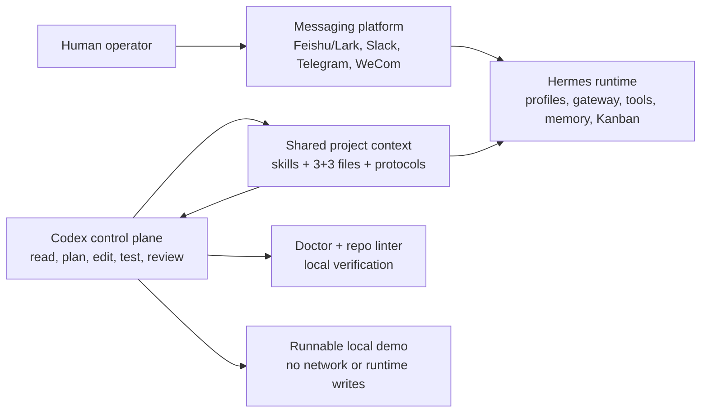

# Hermes-Codex Control Plane

A public, reusable operating pattern for using Codex as the development control plane for Hermes-powered messaging-agent systems.

Use this repo when you want Codex to safely build, repair, test, and document Hermes-powered agents while Hermes and the messaging platform continue to run the daily workflow.

What is included:

- Codex skills for loading Hermes architecture and project operating rules.
- A 3+3 project file standard that keeps model startup context small.
- A unified `hccp` CLI that routes setup, checks, and demo commands from one entrypoint.
- A Protocol Doctor for target projects and a repo linter for this public package.
- A local runnable demo that proves the pattern without network calls or runtime side effects.
- Migration guides for moving existing Hermes projects into the 3+3 standard.
- Human-readable protocols for planning, high-risk confirmation, and multi-agent development.

The core split:

- **Codex builds the system**: architecture, code changes, tests, reviews, and multi-agent development coordination.
- **Hermes runs the system**: profiles, gateway, tools, skills, memory, Kanban, and messaging-platform execution.
- **Messaging apps are the operating surface**: Feishu/Lark, Slack, Telegram, WeCom, or similar platforms are how humans trigger and consume the runtime.

This project turns that split into skills, protocols, templates, and scripts that other builders can copy.

## Architecture



Codex builds and verifies the system. Hermes runs the live workflow. The messaging platform remains the human-facing operating surface. See [docs/architecture.md](docs/architecture.md) for the detailed boundary map.

## Why This Exists

Agent projects often fail for boring reasons:

- every new thread has to rediscover the architecture;
- project context is scattered across chats and stale docs;
- multi-agent work starts before tests and acceptance criteria are clear;
- live runtime changes get mixed with development work;
- long-running messaging-agent systems accumulate profile, gateway, credential, and memory risk.

This repo proposes a small standard:

1. put stable architecture knowledge in Codex skills;
2. put project truth in a compact 3+3 file structure;
3. require a planning and test gate before multi-agent implementation;
4. keep development control separate from live runtime execution.

## Quick Start

Install the Codex skills:

```bash
python3 scripts/hccp.py install-skills
```

Initialize the standard files in a project:

```bash
python3 scripts/hccp.py init /path/to/your-project
```

Run the doctor before the first session:

```bash
python3 scripts/hccp.py doctor /path/to/your-project
```

Point the doctor at the target project directory, not this repository root. `PASS` means no errors or warnings. `WARN` means warnings were found but no errors. `FAIL` means required files, required sections, or safety hygiene need attention before Codex treats the project as ready.

Exit codes:

- `0`: no errors, including warning-only projects by default;
- `1`: validation errors, or warnings when `--strict-warnings` is used;
- `2`: usage or project-path errors.

For JSON output:

```bash
python3 scripts/hccp.py doctor /path/to/your-project --json
```

The JSON report includes `ok`, `project_path`, `errors`, `warnings`, and `summary`. `ok` means there are no validation errors; under `--strict-warnings`, warning-only reports still have `ok: true` but the process exits `1`.

Use `--strict-warnings` for release or CI-style checks where warnings should block.

Try the local runnable demo:

```bash
python3 scripts/hccp.py demo --json
```

The demo reads a bundled text fixture and writes local Markdown, raw source, index, and report artifacts under `examples/knowledge-ingestion-agent/demo-output/`. It performs no network calls, external writes, messaging sends, credential edits, or Hermes gateway operations.

Then start a Codex session with:

```text
启动 Hermes 开发控制台协议，项目：/path/to/your-project，任务：<what you want to change>
```

This trigger phrase means Codex may load the relevant skills and use subagents when useful. It does **not** authorize high-risk runtime actions such as real external writes, credential edits, gateway restarts, deletes, pushes, or deployments.

## What You Get

- `skills/hermes-project-operating-manual/`: startup protocol, 3+3 project standard, planning gate, multi-agent rules.
- `skills/hermes-architecture/`: Hermes runtime architecture map and risk/test routing.
- `protocols/hermes-development-control-plane.md`: human-readable operating protocol.
- `protocols/multi-agent-contract.md`: explorer / worker / verifier contract for Codex subagents.
- `docs/architecture.md`: control-plane/runtime architecture map.
- `docs/migration-guide.md`: step-by-step guide for migrating existing projects.
- `docs/legacy-doc-mapping.md`: mapping table from legacy docs into the 3+3 standard.
- `templates/project-standard/`: reusable project files.
- `examples/knowledge-ingestion-agent/`: sanitized example project using the standard, with a local runnable ingestion demo.
- `scripts/hccp.py`: unified CLI entrypoint for install, init, doctor, repo-doctor, and demo workflows.
- `scripts/install_codex_skills.sh`: installs skills into `~/.codex/skills`.
- `scripts/init_project_standard.sh`: initializes project files without overwriting by default.
- `scripts/check_control_plane.py`: verifies the 3+3 structure, required sections, and obvious safety issues.
- `scripts/check_repo_package.py`: verifies this public package has the expected docs, protocols, skills, examples, tests, and safety hygiene.
- `tests/test_check_control_plane.py`: regression tests for pass, warning, failure, safety, JSON, and exit-code behavior.

## The 3+3 Project Standard

Default 3+3 project items:

```text
AGENTS.md
PROJECT_BRIEF.md
WORKPLAN.md
docs/DECISIONS.md
docs/RISKS.md
docs/project-log/
```

Optional domain files:

```text
docs/SOURCE_POLICY.md
docs/TERMS.md
```

The point is not documentation for its own sake. The point is to keep the startup context small enough for models to read every time, while preserving deeper docs for decisions, risks, and history.

## Who This Is For

This is useful if you are building:

- a Hermes-based personal or team agent;
- a Feishu/Lark or Slack workflow agent;
- a content ingestion or knowledge-base agent;
- a multi-agent coding or operations workflow;
- any long-lived agent system where runtime execution and development work should stay separate.

## What This Is Not

This is not:

- a replacement for Hermes;
- a live messaging gateway;
- a credential manager;
- a promise that Codex should operate production systems directly;
- a one-size-fits-all project-management methodology.

It is an operating pattern and starter kit.

## Recommended Rollout

1. Install the skills.
2. Initialize one non-critical project with the 3+3 standard.
3. Run the doctor and fix any failures.
4. Run several real development sessions using the trigger phrase.
5. Adjust the templates to your organization.
6. Only then migrate older, more complex projects.

## Maintainer Checks

Run the local verifier and its regression tests before publishing changes:

```bash
python3 -m py_compile scripts/hccp.py tests/test_hccp_cli.py
python3 -m py_compile scripts/check_control_plane.py tests/test_check_control_plane.py
python3 -m py_compile scripts/check_repo_package.py tests/test_check_repo_package.py
python3 -m py_compile examples/knowledge-ingestion-agent/scripts/run_demo.py tests/test_runnable_demo.py
python3 scripts/hccp.py repo-doctor . --strict-warnings
python3 scripts/hccp.py doctor examples/knowledge-ingestion-agent
python3 scripts/hccp.py doctor templates/project-standard
python3 tests/test_hccp_cli.py
python3 tests/test_check_control_plane.py
python3 tests/test_check_repo_package.py
python3 tests/test_runnable_demo.py
```

The tests use only the Python standard library.

## Status

Public v0.1 packaging is present. The current focus is v0.2 Protocol Doctor hardening before adding heavier automation.
