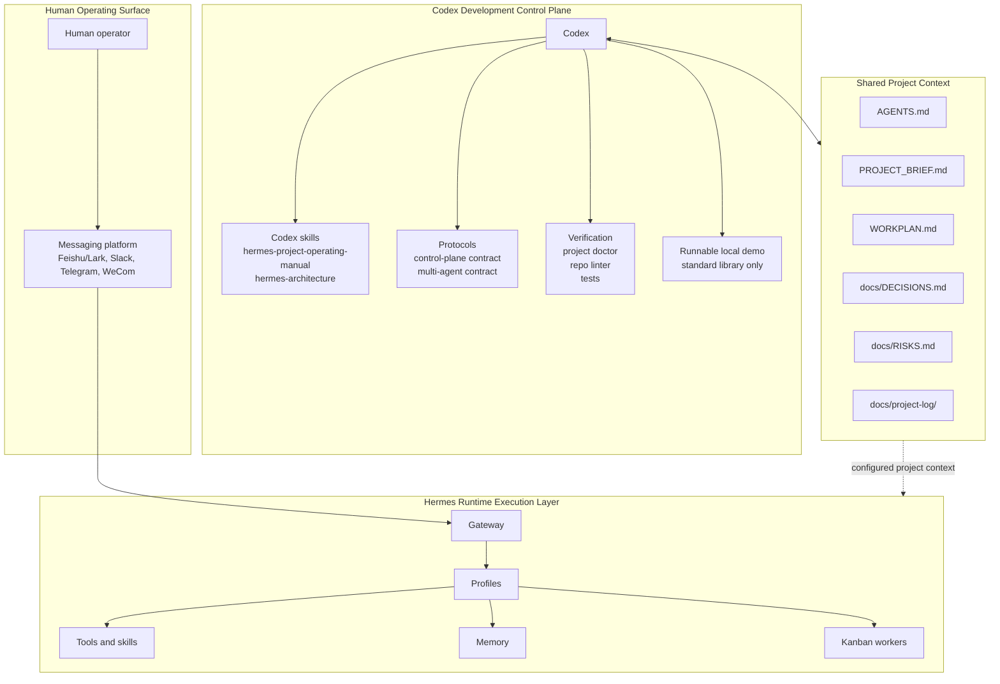

# Architecture

Hermes-Codex Control Plane separates development control from live runtime execution.

## System Map

## Boundary Rules

- Codex edits, tests, reviews, documents, and coordinates development agents.
- Hermes profiles, gateway, tools, memory, and Kanban execute runtime workflows.
- Messaging platforms are ingress and operating surfaces, not development-control state.
- Skills carry durable architecture and operating knowledge.
- Project files carry current project truth and verification contracts.
- Doctor scripts check structure and safety before a project becomes a reliable control-plane target.
- Runtime-sensitive changes require explicit confirmation before Codex touches profiles, gateway config, credentials, live sends, deletes, restarts, pushes, publishes, or deployments.

## Data Flow

1. A human triggers work through Codex by naming the project and task.
2. Codex loads the operating manual skill and reads the 3+3 project context.
3. Codex plans, uses Explorer/Worker/Verifier agents when useful, edits files, and runs checks.
4. Hermes continues to run the live workflow through its own gateway/profile/runtime layer.
5. High-risk runtime actions require explicit confirmation before Codex touches them.

## What Stays Local

The bundled runnable demo is intentionally local-only:

- no URL fetching;
- no external API calls;
- no messaging sends;
- no credential edits;
- no Hermes gateway start or restart.

This makes it safe as a public example and useful as a smoke test for the operating pattern.
